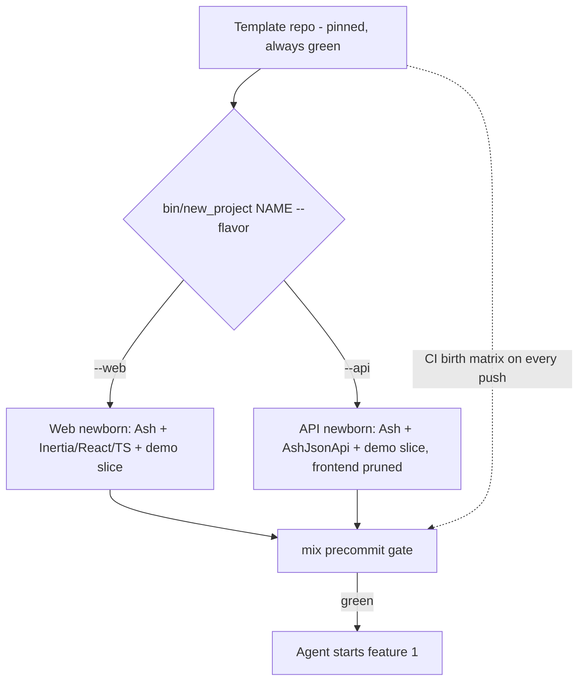
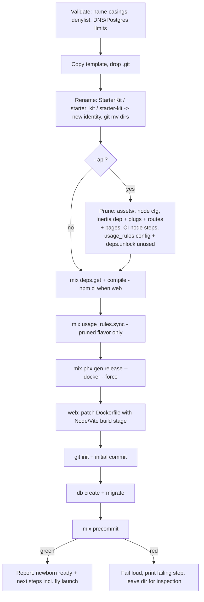

# Phoenix Starter Kit - Plan

## Goal Capsule

- **Objective:** A pinned, always-green Phoenix/Ash superset template repo plus a turnkey birth script that produces either a JSON API project or an Inertia+React web project, optimized so AI agents can start shipping features immediately.
- **Product authority:** Robert — sole design authority and maintainer. AI agents execute builds and maintenance; external users consume read-only.
- **Execution profile:** Build in dependency order U1 → U11; the quality gate (`mix precommit`) must pass at every unit boundary. Repo starts empty — U1 creates it.
- **Stop conditions:** Surface instead of guessing when (a) a pinned version pair fails to compile together, (b) the `inertia` 2.6.2 + `phoenix_vite` wiring cannot be made to work without moving to the 3.x RC line, or (c) any change would alter Product Contract scope.
- **Open blockers:** None. All version and integration claims verified 2026-07-06 against hex.pm/npm/GitHub primary sources (see Planning Contract).

---

## Product Contract

### Summary

Build one template repository containing a complete, working Phoenix 1.8 / Elixir 1.20 / Ash 3 application — Inertia+React+TypeScript web stack, JSON:API layer with auto-generated OpenAPI, auth, jobs, admin, quality gate, and agent-guidance layer — with a birth script that clones, renames, prunes to a `--web` or `--api` flavor, and proves the newborn green. Published as a public read-only open-source GitHub template; maintained by deliberate dep-bump refreshes.

### Problem Frame

Robert builds a growing number of startup projects with AI agents doing the implementation. Each new project currently starts from scratch: the same auth, jobs, tooling, CI, and frontend wiring gets re-derived or copied piecemeal from previous repos, and each repo drifts (one uses esbuild, another Vite; different auth setups; different quality gates). The real cost is not human setup time — it is that an agent dropped into a fresh codebase has no wired substrate and no blessed patterns, so the first features are slow and inconsistent. The two most recent reference projects (`software-factory-ai`, `circle-clone-elixir`) show a stable personal stack has already converged: Ash, Oban, React 19, Tailwind, strict quality gates. That convergence is currently trapped in individual repos instead of being a reusable, verified starting point.

### Key Decisions

- **Pinned known-good snapshot, not pull-latest-at-creation.** A template with exact pinned versions (`mix.lock`, lockfiles committed) that is proven green beats composing latest packages at birth, which risks compatibility roulette. Supersedes an earlier pull-latest preference. Freshness is handled by a documented refresh workflow instead.
- **Ash Framework over vanilla Phoenix contexts.** Matches how Robert actually builds (both reference repos and Conveyor are Ash). Declarative resources mean less hand-rolled code for agents to get wrong; `usage_rules` closes the agent-legibility gap left by thinner LLM training data.
- **One superset template with prune-at-birth, not two sibling templates.** Projects are either-or (API or web), but two repos means every shared change is maintained twice. One repo carries the full web stack; the birth script prunes to the API flavor. CI runs the birth matrix so both flavors are provably green at all times.
- **Agent-first design center.** The kit's primary user is the AI agent building features, not a human reading docs. Everything follows: wired-and-working over documented-but-manual, in-repo pattern code over prose, machine-checkable quality gates as the definition of done.
- **Inertia+React, not LiveView, for the web flavor.** The web UI is React 19 via Inertia.js; LiveView appears only as the LiveDashboard/AshAdmin surfaces.
- **Demo vertical slice as pattern corpus.** One end-to-end example feature ships inside every newborn project so agents learn conventions from working code, removable by script once real features exist.
- **Personal-first, open-source read-only.** Public repo under MIT so others can use and fork it, but contributions are closed — no PRs accepted, no community governance. Design decisions never route through external users.

---

### Actors

- A1. Robert — owner, sole maintainer, design authority; runs refresh cycles.
- A2. AI build agents — primary consumers; build features inside newborn projects and execute kit maintenance under A1's direction.
- A3. External developers — read-only adopters; clone/fork the public template, receive no support and submit no contributions.

---

### Requirements

**Template core (both flavors)**

- R1. The template is a complete, runnable Phoenix 1.8 application on Elixir 1.20 with PostgreSQL, all dependencies pinned exactly, and the full quality gate green at every commit.
- R2. Domain layer is Ash 3 (`ash`, `ash_postgres`, `ash_phoenix`); all domain logic lives in Ash resources and actions.
- R3. Authentication is AshAuthentication with magic-link and email/password strategies working end-to-end day-one, including emails via Swoosh.
- R4. Background jobs run on Oban integrated with Ash (`ash_oban`).
- R5. AshAdmin is mounted in all environments, with production access gated behind admin authentication.
- R6. Observability is Phoenix LiveDashboard with Ecto, Oban, and VM metrics; no external error-tracking service ships in the box.
- R7. `runtime.exs` validates required environment variables and fails boot fast, naming what is missing.
- R8. Email uses a local adapter in dev/test and a production adapter configuration stub.

**Web flavor**

- R9. Frontend is Inertia.js 2 + React 19 + TypeScript, bundled by Vite, styled with Tailwind 4.
- R10. shadcn/ui is set up with a core component set (button, form, input, dialog, table at minimum) copied into the repo.
- R11. Auth screens (sign-in, magic link, registration, account settings) exist as working Inertia pages built from shadcn components.
- R12. A typed Inertia page-props pattern (shared TypeScript types for controller-to-page data) is established and demonstrated.

**API flavor**

- R13. Resources are exposed via AshJsonApi with an auto-generated OpenAPI spec and a served API docs page.
- R14. API authentication supports both API keys and JWT bearer tokens, enforced through Ash policies, with a working example of each.

**Quality gate and CI**

- R15. A single `mix precommit` alias runs the full gate: format check, compile with warnings-as-errors, credo strict, sobelow, deps.audit, dialyzer, and the test suite.
- R16. GitHub Actions runs the quality gate plus a birth matrix: on every push, both flavors are born from the template and their gates run green.
- R17. Testing harness includes Ash.Generator-based fixtures, Mimic for mocks, stream_data with at least one example property test, and Playwright E2E for the web flavor with an auth smoke test.

**Agent layer**

- R18. `AGENTS.md` documents stack conventions, blessed patterns, project commands, and the definition of done (gate green).
- R19. Package usage rules are synced into the repo via `usage_rules` so agents get Ash-ecosystem guidance in context.
- R20. Tidewave runs in dev, giving agents runtime inspection of the live app.

**Birth script**

- R21. One command creates a new project: copy the template, rename app and modules, initialize git, set up the database, install dependencies, and run the full gate — the newborn is proven green with zero manual steps.
- R22. The command takes a `--web` or `--api` flavor; `--api` removes the entire frontend surface (assets, node tooling, Inertia, web routes and layouts) leaving a pure API app with no dead residue.
- R23. The demo vertical slice ships inside every newborn (resource, policies, migration, tests, plus flavor-appropriate surface: Inertia page and form, or JSON:API endpoint), and a removal script strips it cleanly with the gate staying green.

**Open-source packaging**

- R24. The template is a public GitHub template repository under the MIT license, with a README quickstart usable by a stranger and no personal secrets or machine-specific config.
- R25. Contribution posture is closed: the README states the project accepts no PRs and offers no support; repository settings reflect this.

**Maintenance**

- R26. A documented refresh workflow exists: an agent-driven dep-bump session that upgrades pinned versions, runs the gate and birth matrix, and cuts a new known-good snapshot only when everything is green.

---

### Key Flows



- F1. Web project birth
  - **Trigger:** A1 or A2 runs the birth command with `--web`.
  - **Steps:** Template copied; app and modules renamed; git initialized; database created; deps installed; full gate runs.
  - **Outcome:** Green Inertia+React project with working auth screens and demo slice; agent can start feature #1 immediately.
  - **Covers:** R21, R23.
- F2. API project birth
  - **Trigger:** Birth command with `--api`.
  - **Steps:** As F1, plus prune step removes assets, node tooling, Inertia wiring, and web routes before the gate runs.
  - **Outcome:** Green pure-API project serving JSON:API with OpenAPI docs; no frontend residue.
  - **Covers:** R21, R22, R23.
- F3. Demo slice removal
  - **Trigger:** First real features exist; A2 runs the removal script.
  - **Steps:** Script deletes slice code, migrations handled, references cleaned; gate runs.
  - **Outcome:** Clean project, gate green.
  - **Covers:** R23.
- F4. Kit refresh cycle
  - **Trigger:** A1 decides to refresh (new Phoenix/Ash releases accumulate).
  - **Steps:** A2 bumps pinned versions; gate plus CI birth matrix run; failures fixed or bumps reverted.
  - **Outcome:** New known-good snapshot cut; template stays the single source of truth.
  - **Covers:** R1, R16, R26.

---

### Acceptance Examples

- AE1. **Covers R22.** Given the template, when a project is born with `--api`, then no `assets/` directory, `package.json`, or Inertia reference exists in the newborn and `mix precommit` passes.
- AE2. **Covers R21, R23.** Given the template, when a project is born with `--web`, then `mix precommit` passes and the demo slice renders as a working Inertia page behind auth.
- AE3. **Covers R23.** Given a newborn with the demo slice, when the removal script runs, then no slice code remains and `mix precommit` still passes.
- AE4. **Covers R5.** Given a production build, when an unauthenticated or non-admin user requests the admin route, then access is denied.
- AE5. **Covers R7.** Given a required environment variable is unset in production, when the app boots, then it exits immediately with an error naming that variable.

---

### Success Criteria

- An agent dropped into a fresh newborn ships a small feature (resource + policy + test + UI or endpoint) using only in-repo context — no setup work, no convention questions.
- New project birth to green gate completes in minutes, hands-off.
- CI continuously proves both flavors green on the template's main branch.
- A stranger can produce a working project from the public README alone.

---

### Scope Boundaries

**Deferred for later**

- OAuth providers (Google/GitHub) — strategy stubs can come in a later refresh. AshAuthentication's OAuth2 strategy with a hand-rolled Inertia controller has zero real-world validation; budget an explicit spike when this lands.
- External error tracking (Sentry or similar) — per-project addition.
- Rate limiting on auth and API endpoints — per-project addition; the template ships the policy/plug seams but no limiter.
- `ash_ai` (in-app AI features), payments/billing, file uploads — added per project when a project needs them.
- Inertia SSR — the Vite-flavored SSR path is an open experimental PR upstream; revisit at the first refresh cycle.
- `oban_web` dashboard — free and one mount line, but LiveDashboard's Oban metrics cover day-one needs.
- Re-pin to the `inertia` 3.x / `ash_authentication` 5.x / `ash_authentication_phoenix` 3.x line once those majors GA (all are mid-RC as of 2026-07-06).

**Outside this product's identity**

- LiveView as the UI layer — the web flavor is Inertia/React by decision.
- Pull-latest-at-creation generator (igniter-composition kit shape) — rejected for compatibility risk.
- Community-governed open source — no PRs, no roadmap for others, no support obligations.
- A vanilla-Phoenix (non-Ash) variant.
- Multi-axis flavor flags (beyond the single `--web`/`--api` binary) — create-t3-app's combinatorial variant explosion is the documented failure mode; expanding the flavor axis is a redesign trigger, not an extension.

---

### Dependencies / Assumptions

All ecosystem claims verified 2026-07-06 against hex.pm, npm, and GitHub primary sources (exact pins in Planning Contract → Version Matrix):

- AshJsonApi auto-generates an OpenAPI spec served as raw JSON at an `open_api` route; a docs UI is not bundled — `open_api_spex`'s SwaggerUI plug provides it.
- AshAuthentication 4.14 ships password, magic-link, API-key, and token/JWT strategies; its plug layer is framework-agnostic and works without LiveView pages.
- The `inertia` hex adapter (2.6.2 stable) works with React 19 and TypeScript; Vite integration rides the community `phoenix_vite` package, following the maintainer-authored example on the adapter's 3.x branch.
- Tailwind 4 + Vite + shadcn/ui on plain React is officially documented and working.
- `usage_rules` and Tidewave install cleanly on the pinned stack.
- PostgreSQL and GitHub (template repo flag, Actions) are infrastructure defaults. Fly.io is the deploy target, but `fly.toml`/`Dockerfile` are generated at birth rather than committed (Fly's own team recommends against committed platform config in templates).

---

### Sources / Research

- `~/Projects/startups/software-factory-ai` (machine-local reference) — Ash + Inertia 2.6 + React 19 + esbuild + Tailwind, Phoenix 1.8.8, Oban, Credo strict, Dialyzer, Ash-fixture and stream_data testing, GitHub Actions gate. Evidence for the converged stack and quality gate.
- `~/Projects/wts-dops/circle-clone-elixir` (machine-local reference) — Ash 3 + AshAuthentication, Phoenix 1.8.7, Oban, Swoosh, Vite + React 19 + TypeScript + Tailwind 4 (decoupled SPA), quality alias including sobelow, `runtime.exs` secrets validation. Evidence for AshAuthentication, Vite, and the fuller gate.
- Kit intentionally recombines these: circle-clone's tooling rigor and Vite frontend stack on software-factory-ai's Inertia architecture.
- External research (2026-07-06, two passes, 60+ primary-source checks): version matrix verified live against hex.pm/npm/GitHub APIs; prior-art survey of Phoenix/Rails/cookiecutter/t3 template ecosystems. Load-bearing findings cited inline in Key Technical Decisions below.
- `github.com/joangavelan/noted_ash` — real-world Ash + Inertia + AshAuthentication app; the reference implementation for the hand-rolled auth controller pattern (KTD3).
- `github.com/inertiajs/inertia-phoenix` — official adapter; `examples/vite/react/` on the 3.x branch is the wiring reference for U4; `mix inertia.install` source defines canonical plug/config placement.
- Ash Discord thread "Custom Authentication Flow with AshAuthentication in Phoenix + React (Inertia.js)" (answeroverflow.com/m/1368010593818378320) — could not be fetched by automated research (429); worth a manual read before U5.

---

## Planning Contract

**Product Contract preservation:** Requirements, Actors, Flows, and Acceptance Examples unchanged from the brainstorm. Updated in place: Dependencies/Assumptions (unverified claims → verified, with the fly.toml assumption revised to birth-time generation), Scope Boundaries (added OAuth spike note, SSR/oban_web/re-pin deferrals, multi-axis non-goal), Sources (research provenance). R22's "frontend surface" is clarified by KTD7: AshAdmin, LiveDashboard, and the Swoosh mailbox are not part of the pruned surface.

### Version Matrix (the pin set)

All verified live 2026-07-06. `mix.lock` / `package-lock.json` committed; these are the load-bearing pins.

> **Erratum (postdates this pass):** the shipped runtime is **Erlang 29.0.2 / Elixir 1.20.1-otp-29** (canonical, tracked by `.tool-versions` and the README) — supersedes the Elixir 1.20.2 / OTP 27.3.4.14 row below, which reflects the original 2026-07-06 OTP-27 primary-source pass.

| Layer | Package | Pin |
|---|---|---|
| Runtime | Elixir / OTP | 1.20.2 / 27.3.4.14 (`.tool-versions` drives local, CI, and Dockerfile ARGs) |
| Framework | phoenix (Bandit adapter) | 1.8.8 (bandit 1.12.0) |
| Framework | phoenix_live_dashboard | 0.8.7 |
| Data | ecto_sql / postgrex | 3.14.0 / 0.22.2 |
| Ash | ash / ash_postgres / ash_phoenix | 3.29.3 / 2.10.0 / 2.3.23 |
| Auth | ash_authentication / ash_authentication_phoenix | 4.14.1 / 2.17.1 (stable line, NOT the 5.x/3.x RCs) |
| Admin | ash_admin | 1.1.0 |
| API | ash_json_api / open_api_spex | 1.7.0 / 3.22.3 |
| Jobs | oban / ash_oban | 2.23.0 / 0.8.10 |
| Email | swoosh | 1.26.3 |
| Inertia | inertia (hex) / @inertiajs/react (npm) | 2.6.2 / 2.3.27 (npm `legacy` tag — matches the stable adapter line) |
| Frontend | vite / phoenix_vite | 8.1.3 / 0.4.3 |
| Frontend | react / typescript / tailwindcss | 19.2.7 / 6.0.3 / 4.3.2 (+ @tailwindcss/vite) |
| Frontend | shadcn CLI | 4.13.0 (`new-york` style; `tw-animate-css`, not deprecated `tailwindcss-animate`) |
| Agent | usage_rules / tidewave | 1.2.6 / 0.6.1 |
| Testing | mimic / stream_data / phoenix_test_playwright | 2.3.0 / 1.3.0 / 0.15.0 |
| Quality | credo / dialyxir / sobelow / mix_audit | 1.7.19 / 1.4.7 / 0.14.1 / 2.1.5 |

### Key Technical Decisions

- KTD1. **Pin the all-stable set; skip the RC line.** `inertia` 3.0, `ash_authentication` 5.0, and `ash_authentication_phoenix` 3.0 are all mid-RC simultaneously. The template's promise is a known-good snapshot, so it pins `inertia` 2.6.2 + `@inertiajs/react` 2.3.27 (npm `legacy`) + `ash_authentication` 4.14.1. The re-pin lands as a scheduled refresh (Scope Boundaries) once those majors GA.
- KTD2. **Vite integration via `phoenix_vite`, ported from the adapter's official 3.x example.** The stable adapter has no Vite docs; the maintainer-authored `examples/vite/react/` (3.x branch) depends on `phoenix_vite`, which feeds Vite's `manifest.json` into Phoenix's native `cache_static_manifest_latest` — no `phx.digest` hacks. The Elixir-side Inertia API (`assign_prop`/`render_inertia`) is unchanged between 2.6.2 and 3.x, so the wiring is expected to port; U4 proves it first.
- KTD3. **Auth is hand-rolled Inertia controllers (Pattern B), not AshAuthentication's LiveView routes.** Controllers (`SessionController`, `RegistrationController`, `MagicLinkController`, `SettingsController`) call Ash code-interface actions directly; `AshAuthentication.Plug.Helpers` (`store_in_session`, `retrieve_from_session`, `set_actor`) handle session plumbing as plain plugs; a shared plug exposes `current_user` as an Inertia prop. Magic-link callback is a plain GET with `?token=` — no LiveView. `AshPhoenix.Inertia.Error` maps Ash errors to Inertia's form-error shape. Reference: `noted_ash`.
- KTD4. **Birth script is an Elixir script (`bin/new_project`), not bash.** Elixir is present by definition, sidesteps BSD/GNU sed divergence, and is unit-testable. It manages three name casings — `StarterKit` (module), `starter_kit` (OTP app/DB/npm), `starter-kit` (infra/DNS slug) — with a denylist rejecting reserved names (`Phoenix`, `Ash`, `Ecto`, `Oban`, `Elixir`, `Mix`) and validation against atom/DNS/Postgres-63-byte rules. Rename runs before any compile so no stale `_build` paths exist. The quality gate is the rename verifier — no trust in the rename step itself.
- KTD5. **Prune design: colocated named prune steps + regenerate-and-assert CI.** The `--api` prune is a set of small named steps (each documented next to the feature it removes) driven by a manifest in the birth script — Rails' `--api` deletion-method discipline, not cookiecutter's distant 600-line hook. The honesty mechanism is CI (U10), not list discipline: every push births both flavors and runs their gates. Prune also rewrites `mix.exs` (drop Inertia dep), runs `mix deps.unlock --unused` so `mix.lock` sheds the removed packages (AE1's residue grep would otherwise trip), prunes the `usage_rules` config, and re-runs `mix usage_rules.sync` (after deps are fetched) so agent docs never reference removed deps.
- KTD6. **`Dockerfile`/`fly.toml` are generated at birth, never committed.** Birth runs `mix phx.gen.release --docker --force` after rename+prune — Phoenix's generator is already flavor-aware (assets detection) and emits the correct app name. The generated Dockerfile assumes esbuild's standalone binary, so for the web flavor the birth script patches in a Node build stage (`npm ci` + Vite build), and the template defines a `mix assets.deploy` alias (Vite production build + digest, via phoenix_vite) that the Dockerfile's asset step resolves; the birth-matrix web leg runs a `docker build` smoke so the generated deploy artifact is actually exercised. The README documents `fly launch --no-deploy` as the deploy-init step (fly names must be globally unique; Fly's tool owns that). Rationale: Fly's own team publicly traced production incidents to committed template fly.tomls going stale.
- KTD7. **`--api` prune scope: Inertia/React/Vite/node only.** AshAdmin, LiveDashboard, and the Swoosh dev mailbox remain in both flavors — they are self-contained LiveView islands independent of the app's rendering choice, and LiveView is in the dependency tree transitively regardless (via ash_admin/ash_authentication_phoenix).
- KTD8. **Testing idioms are deliberately plural.** `Inertia.Testing` + `Phoenix.ConnTest` for web-flavor controller assertions (phoenix_test has no Inertia awareness and is omitted); plain ConnTest for JSON:API; `phoenix_test_playwright` for browser E2E — ExUnit tests under `test/e2e/` tagged `:playwright`, excluded from the default `mix precommit` run and invoked with `mix test --only playwright` (browser deps stay out of the fast gate); `Ash.Generator` fixtures + Mimic + stream_data underneath. AGENTS.md names this as an intentional convention.
- KTD9. **Demo slice domain is Notes.** Small, universal, exercises every layer: resource + policies + migration + Ash tests + Inertia page with a shadcn form + JSON:API endpoint. Placeholder identity of the template itself: app `starter_kit`, module `StarterKit` — chosen to avoid substring collisions with framework names during rename.
- KTD10. **Formatter: `plugins: [Spark.Formatter]` only.** Styler was considered and dropped: no requirement asks for it, coexistence with Spark.Formatter is undocumented, and credo --strict already covers style enforcement. Acceptance test stays: `mix format` idempotency (run twice, no diff).
- KTD11. **Anti-rot automation on the template itself.** Dependabot (mix + npm ecosystems, grouped monthly) plus a weekly scheduled run of the full CI (gate + birth matrix) so yanked packages, runner drift, and lockfile rot surface within a week, not at the next birth. GitHub's restrict-PRs-to-collaborators setting (Feb 2026 feature) keeps the contribution door closed while still allowing bot PRs.
- KTD12. **Single source of truth for the gate.** The `mix precommit` alias in `mix.exs` is the only place the gate's steps are enumerated; CI and all docs reference the alias by name. Prevents docs/CI drift structurally.

### High-Level Technical Design

Birth pipeline (the heart of U9):



Ordering constraint: `mix usage_rules.sync` and `mix phx.gen.release` are tasks *provided by dependencies* — they cannot run until `deps.get` + compile have completed in the newborn (the copy step excludes `deps/` and `_build/`).

CI topology: two workflows. `ci.yml` — the template's own gate on every push. `birth-matrix.yml` — matrix `flavor: [web, api]`, runs `bin/new_project` into a temp dir, runs the newborn's full gate (+ Playwright job for web), on every push and weekly cron.

### Output Structure

Expected template layout (scope declaration, not a straitjacket):

```text
starter-kit/
├── .github/workflows/{ci.yml, birth-matrix.yml}
├── .github/dependabot.yml
├── .tool-versions
├── AGENTS.md                      # minimal hand-written + usage_rules managed section
├── README.md / LICENSE / .env.example
├── assets/                        # web flavor; pruned for --api
│   ├── package.json / vite.config.ts / tsconfig.json
│   ├── css/app.css                # Tailwind 4 CSS-first config
│   └── js/{app.tsx, ssr-less pages/, components/ui (shadcn), lib/, types/}
├── bin/{new_project, remove_demo}
├── config/{config,dev,test,prod,runtime}.exs
├── lib/starter_kit/
│   ├── accounts/ (user, token, senders, policies)
│   ├── notes/    (demo slice)
│   └── {application,repo,mailer,secrets}.ex
├── lib/starter_kit_web/
│   ├── controllers/ (auth Pattern B, page, demo notes)
│   ├── plugs/ (load_user, set_actor, inertia_share)
│   ├── router.ex  (browser + api + admin + dev scopes)
│   └── endpoint.ex (Tidewave dev plug, phoenix_vite integration)
├── priv/repo/migrations/
└── test/ (ConnTest + Inertia.Testing, Ash action tests, property test, e2e/ Playwright ExUnit tests, support/)
```

### Risks & Dependencies

| Risk | Likelihood / Impact | Mitigation |
|---|---|---|
| `inertia` 2.6.2 + `phoenix_vite` wiring doesn't port from the 3.x example | Moderate / High (blocks R9) | U4's first task proves it before anything builds on it; Goal Capsule stop condition fires on failure. Fallback options to surface to A1: adopt the 3.0 RC, or fall back to the official installer's esbuild wiring (changes R9 — product call, not plan call). |
| Triple-RC churn (`inertia` 3.0, `ash_authentication` 5.0, `ash_authentication_phoenix` 3.0 all GA soon) forces an early refresh | High / Low | Pinned all-stable set is immune until a refresh is chosen; `docs/refresh.md` re-pin pass is the planned response, listed in Scope Boundaries. |
| sobelow (9 months stale) breaks on Elixir 1.20 | Medium / Low | U1 smoke test; documented in-gate skip path with the decision recorded in AGENTS.md. |
| Single-maintainer dependencies: `inertia` hex (sole owner) and `phoenix_vite` | Low / Medium | Pins make this a refresh-time concern, not a runtime one; reassess at each refresh cycle; the esbuild path remains the documented escape hatch. |
| Birth-matrix CI cost: each newborn cold-builds a dialyzer PLT (~5-10 min per leg) | High / Medium (slow CI, expensive feedback) | Cache `priv/plts` in `birth-matrix.yml` keyed on the template's `mix.lock` — newborn deps are identical to the template's, so the PLT is reusable across births. |
| Security posture gaps in newborns | Low / High if missed | In the box: bcrypt passwords, hashed API keys, policy-enforced authorization, AshAdmin prod gate (AE4), env validation (AE5), sobelow + deps.audit in the gate, no tracked secrets (DoD grep). Known day-one gap: no rate limiting on auth/API endpoints — named in Scope Boundaries as per-project. |
| GitHub repo settings (is_template, PR restriction, Dependabot) are manual, not committed code | Certain / Low | U11 ships an explicit settings checklist; DoD requires A1 to apply before publish. |

### Assumptions (planning-level)

- The `inertia` 2.6.2 + `phoenix_vite` 0.4.3 pairing works as the 3.x example does; U4's first task verifies before anything builds on it.
- sobelow 0.14.1 (9 months stale, Elixir 1.20 unconfirmed) runs on this stack; U1 smoke-tests it — if it breaks, gate keeps it with a documented skip and a Deferred item.
- The Swoosh mailbox-preview plug module name is confirmed from swoosh's README at implementation time (deliberately not guessed here).

---

## Implementation Units

| U-ID | Title | Key files | Depends on |
|---|---|---|---|
| U1 | Repo bootstrap + quality gate + CI #1 | mix.exs, .tool-versions, .github/workflows/ci.yml | — |
| U2 | Ash core + agent layer | lib/starter_kit/, AGENTS.md, mix.exs | U1 |
| U3 | Auth domain (Ash resources + strategies) | lib/starter_kit/accounts/ | U2 |
| U4 | Vite + Inertia + React + Tailwind + shadcn substrate | assets/, endpoint.ex, router.ex | U2 |
| U5 | Auth web UI (Pattern B controllers + pages) | lib/starter_kit_web/controllers/, assets/js/pages/auth/ | U3, U4 |
| U6 | Jobs, admin, dashboard | application.ex, router.ex | U3 |
| U7 | JSON:API layer + API auth | lib/starter_kit_web/api_router.ex | U3 |
| U8 | Demo Notes slice + remove_demo | lib/starter_kit/notes/, bin/remove_demo | U5, U7 |
| U9 | Birth script | bin/new_project | U8 |
| U10 | Birth-matrix CI + anti-rot automation | .github/ | U9 |
| U11 | Docs, packaging, repo settings | README.md, AGENTS.md | U10 |

### U1. Repo bootstrap, quality gate, template CI

- **Goal:** A green Phoenix 1.8.8 app named `starter_kit` with the full quality gate and CI from the first commit.
- **Requirements:** R1, R15, R24 (license/readme stubs).
- **Dependencies:** None.
- **Files:** `mix.exs`, `.tool-versions`, `.formatter.exs`, `.credo.exs`, `config/*.exs`, `.github/workflows/ci.yml`, `.gitignore`, `.env.example`, `LICENSE`, `README.md` (stub), `test/`.
- **Approach:** `mix phx.new starter_kit --no-html --no-assets --no-gettext` as the base (assets arrive Vite-shaped in U4; no HEEx page layer). Add quality deps (credo, dialyxir, sobelow, mix_audit, styler). Define `mix precommit` alias: format --check-formatted, compile --warnings-as-errors --force, credo --strict, sobelow (config'd), deps.audit, dialyzer, test (KTD12). CI: erlef/setup-beam pinned by SHA, `version-file: .tool-versions`, deps/_build cache keyed on mix.lock, dedicated `priv/plts` dialyzer cache with split restore/save, Postgres 16 service container with TZ=UTC.
- **Execution note:** Smoke-test sobelow on Elixir 1.20 here; if incompatible, configure the gate without it and record the decision in AGENTS.md + Scope Boundaries.
- **Test scenarios:** Test expectation: none — pure scaffolding/config; verification is the gate itself running green locally and in CI.
- **Verification:** `mix precommit` green locally; `ci.yml` green on push; dialyzer PLT cache hits on second CI run.

### U2. Ash core + agent layer

- **Goal:** Ash 3 domain skeleton plus the agent-legibility layer, so every subsequent unit is built with agent guidance in place.
- **Requirements:** R2, R18 (skeleton), R19, R20.
- **Dependencies:** U1.
- **Files:** `mix.exs`, `lib/starter_kit/application.ex`, `lib/starter_kit/repo.ex` (AshPostgres.Repo), `.formatter.exs`, `AGENTS.md`, `config/config.exs`, `lib/starter_kit_web/endpoint.ex`.
- **Approach:** Add ash/ash_postgres/ash_phoenix; convert Repo to `AshPostgres.Repo`; register `ash_domains`. Formatter `plugins: [Spark.Formatter]` with import_deps (KTD10). Install usage_rules with `mix.exs` config targeting AGENTS.md managed section (`:all` ash-ecosystem deps); run `mix usage_rules.sync`. Add `plug Tidewave` in endpoint under `if Mix.env() == :dev`. AGENTS.md hand-written part stays minimal: template-not-app warning, `mix precommit` as definition of done, flavor conventions pointer — non-discoverable info only.
- **Patterns to follow:** usage_rules managed-marker convention; Tidewave README endpoint placement.
- **Test scenarios:** Format idempotency — run `mix format` twice, second run produces no diff (KTD10 acceptance). Repo starts and migrates against Postgres.
- **Verification:** Gate green; `AGENTS.md` contains synced managed section; Tidewave responds in dev.

### U3. Auth domain

- **Goal:** AshAuthentication user/token resources with password + magic-link strategies working at the action level, email via Swoosh local.
- **Requirements:** R3, R7, R8.
- **Dependencies:** U2.
- **Files:** `lib/starter_kit/accounts.ex`, `lib/starter_kit/accounts/{user,token}.ex`, `lib/starter_kit/accounts/senders/*.ex`, `lib/starter_kit/mailer.ex`, `config/runtime.exs`, `config/{dev,test}.exs`, `priv/repo/migrations/`, `test/starter_kit/accounts/`, `test/support/`.
- **Approach:** ash_authentication 4.14.1 via its igniter installer where possible, then adapt: User resource with password (bcrypt) + magic_link strategies, plus AshAuthentication's confirmation add-on — password sign-in requires a confirmed email (prevents address squatting; magic link inherently proves ownership); Token resource; senders deliver via Swoosh (Local adapter dev/test, config stub for prod adapter behind env vars). `runtime.exs` central `env!/2`-style validation helper that names missing vars and raises pre-boot (AE5). Test-support: `Ash.Generator`-based generator module for users; Mimic setup in test_helper.
- **Test scenarios:** register with valid email/password succeeds and sends a confirmation email; unconfirmed account cannot password-sign-in, confirmed account can; duplicate email fails with Ash error; sign_in_with_password wrong password fails; magic-link request generates token + sends email (assert Swoosh delivery); magic-link sign-in with valid token succeeds, expired/garbage token fails; Mimic: stub the Swoosh mailer to fail during a magic-link request and assert the action surfaces an error without leaking a usable token; property test (stream_data): password strategy rejects malformed emails across generated inputs. Covers AE5: prod-config test asserting boot raises naming the missing var.
- **Verification:** Gate green; all strategy actions provable in iex.

### U4. Vite + Inertia + React + Tailwind + shadcn substrate

- **Goal:** The web rendering pipeline: Vite-bundled React 19 + TS, Inertia round-trip working, Tailwind 4 + shadcn components in place.
- **Requirements:** R9, R10, R12.
- **Dependencies:** U2.
- **Files:** `assets/package.json`, `assets/vite.config.ts`, `assets/tsconfig.json`, `assets/css/app.css`, `assets/js/app.tsx`, `assets/js/pages/home.tsx`, `assets/js/components/ui/`, `assets/js/types/`, `assets/js/lib/utils.ts`, `lib/starter_kit_web/{endpoint,router}.ex`, `lib/starter_kit_web/components/layouts/root.html.heex`, `lib/starter_kit_web/controllers/page_controller.ex`, `config/{config,dev,prod}.exs`, `test/starter_kit_web/controllers/page_controller_test.exs`.
- **Approach:** Mirror `mix inertia.install`'s structural output (plug placement, config keys, root layout) but Vite-shaped: `phoenix_vite` 0.4.3 wiring per the adapter's official 3.x `examples/vite/react`, `cache_static_manifest_latest` fed from Vite manifest, Vite dev-server watcher in dev.exs. Tailwind 4 CSS-first (`@import "tailwindcss"` + `@theme`); `shadcn init` (new-york) + add button/form/input/dialog/table/label/card. Define a `mix assets.deploy` alias (Vite production build + digest handling via phoenix_vite) — the birth-generated Dockerfile calls it (KTD6). Typed props: `assets/js/types/` with a `PageProps` base, demo'd on home page. SSR off (Scope Boundaries).
- **Execution note:** First task: prove `inertia` 2.6.2 + `phoenix_vite` render one page end-to-end (dev + prod build) before layering Tailwind/shadcn. This is the plan's riskiest integration (KTD2); if it fails, stop per Goal Capsule.
- **Patterns to follow:** `inertiajs/inertia-phoenix` 3.x branch `examples/vite/react`; `ui.shadcn.com/docs/installation/vite`.
- **Test scenarios:** ConnTest + `Inertia.Testing`: home route renders Inertia component "home" with expected props (`inertia_component/1`, `inertia_props/1`); prod build produces hashed assets + manifest consumable by endpoint (asset smoke via `mix assets.build`/vite build in CI); tsc --noEmit passes.
- **Verification:** Dev HMR works; `MIX_ENV=prod` build + boot serves the page; gate green including TS typecheck wired into precommit or CI.

### U5. Auth web UI (Pattern B)

- **Goal:** Working sign-in / register / magic-link / settings screens as Inertia pages with shadcn forms.
- **Requirements:** R11, R12; advances R3.
- **Dependencies:** U3, U4.
- **Files:** `lib/starter_kit_web/controllers/auth/{session,registration,magic_link,settings}_controller.ex`, `lib/starter_kit_web/plugs/{fetch_current_user,require_authenticated,inertia_share}.ex`, `lib/starter_kit_web/router.ex`, `assets/js/pages/auth/*.tsx`, `assets/js/types/auth.ts`, `test/starter_kit_web/controllers/auth/`, `test/e2e/auth_test.exs` (tagged `:playwright` skeleton; runs in U10 CI).
- **Approach:** KTD3 verbatim: controllers call `Accounts` code-interface actions; `AshAuthentication.Plug.Helpers.store_in_session/retrieve_from_session/set_actor` in plugs; `inertia_share` plug assigns `current_user` prop globally; `AshPhoenix.Inertia.Error` for form errors; flash → Inertia props. Magic-link: POST request-form + GET `/auth/magic-link?token=` callback. Settings: email/password change requiring current password.
- **Patterns to follow:** `noted_ash` controllers; AshAuthentication.Phoenix.Controller behaviour docs (JSON example) for success/failure shapes.
- **Test scenarios:** Covers AE2 (partially; birth-level AE2 proven in U9/U10): sign-in page renders with empty errors; valid sign-in redirects + session persists across requests; invalid credentials re-render with `inertia_errors` populated; registration happy path sends confirmation email and shows a confirm-pending state, confirming via emailed link enables password sign-in; magic-link GET with valid token signs in, invalid token safe-fails to sign-in page with flash; sign-out clears session; `require_authenticated` plug redirects anonymous to sign-in; settings change with wrong current password fails.
- **Verification:** Gate green; manual browser pass through all four screens in dev.

### U6. Jobs, admin, dashboard

- **Goal:** Oban wired through ash_oban; AshAdmin mounted and prod-gated; LiveDashboard with Ecto/Oban/VM metrics.
- **Requirements:** R4, R5, R6.
- **Dependencies:** U3.
- **Files:** `mix.exs`, `lib/starter_kit/application.ex`, `config/{config,test}.exs`, `lib/starter_kit_web/router.ex`, `lib/starter_kit_web/telemetry.ex`, `test/starter_kit_web/admin_access_test.exs`, `test/starter_kit/workers/`.
- **Approach:** Oban 2.23 (Postgres notifier, default + mailer queues, testing: :manual in test); ash_oban with one example trigger on the demo-adjacent surface — documented precisely as a polling scheduler, not a DB hook. AshAdmin in a bare `scope "/"` (documented footgun) behind an `:admin` pipeline: dev = open, prod = `require_admin` (an `admin?` flag on User checked by plug + policies). LiveDashboard mounted in same gated scope with oban + ecto telemetry.
- **Test scenarios:** Covers AE4: prod-mode ConnTest — anonymous GET /admin → 401/redirect; non-admin user → denied; admin user → 200. Oban: example worker enqueues + performs in manual mode; ash_oban trigger enqueues expected job for matching record.
- **Verification:** Gate green; /admin and /dashboard reachable in dev; AE4 test green.

### U7. JSON:API layer + API auth

- **Goal:** AshJsonApi router with OpenAPI spec + Swagger UI, guarded by API-key and JWT bearer auth through policies.
- **Requirements:** R13, R14.
- **Dependencies:** U3.
- **Files:** `mix.exs` (ash_json_api, open_api_spex), `lib/starter_kit_web/api_router.ex`, `lib/starter_kit_web/router.ex` (`/api/v1` scope + `:api` pipeline), `lib/starter_kit/accounts/api_key.ex`, `test/starter_kit_web/api/`.
- **Approach:** `use AshJsonApi.Router, domains: [...], open_api: "/open_api"`; SwaggerUI via open_api_spex plug at `/api/docs` (redoc_ui_plug is dead — do not use). API pipeline: `AshAuthentication.Strategy.ApiKey.Plug` (auto-sets actor per docs) + bearer-token retrieval (`retrieve_from_bearer`) for JWT; policies on resources authorize actor. ApiKey resource + generation action (hashed storage). JSON:API envelope/content-type constraints honored as-is.
- **Test scenarios:** OpenAPI JSON served at /api/v1/open_api and validates as OpenAPI 3.x; docs UI page 200; request without credentials → 401 JSON:API error shape; valid API key → 200 with actor-scoped data; valid JWT bearer → 200; expired/revoked key → 401; policy denies cross-user reads (two users, key A cannot read B's records — proven on demo Notes in U8).
- **Verification:** Gate green; curl walkthrough of key + bearer flows in dev.

### U8. Demo Notes slice + removal script

- **Goal:** The pattern corpus: Notes end-to-end through every layer, plus `bin/remove_demo`.
- **Requirements:** R23; exercises R2, R11-R14.
- **Dependencies:** U5, U7 (U6's Oban example is an optional cross-reference, not a sequencing dependency).
- **Files:** `lib/starter_kit/notes.ex`, `lib/starter_kit/notes/note.ex`, `priv/repo/migrations/*_create_notes.exs`, `lib/starter_kit_web/controllers/note_controller.ex`, `assets/js/pages/notes/{index,form}.tsx`, API exposure in `api_router.ex`, `bin/remove_demo`, `test/starter_kit/notes/`, `test/starter_kit_web/{controllers/note_controller_test.exs, api/notes_api_test.exs}`, `test/e2e/notes_test.exs` (tagged `:playwright`).
- **Approach:** Note: title/body/user_id, policies (owner-only), code interface. Inertia CRUD page with shadcn table+dialog+form; JSON:API exposure with the U7 auth; one ash_oban or plain Oban usage example if natural (else keep U6's example authoritative). Every file carries a `# DEMO:` marker comment; `bin/remove_demo` (Elixir script) deletes marker-tagged files, strips marker-tagged lines from shared files (router/api_router/domain registry), generates a drop_notes migration, runs gate. Marker-driven removal keeps the delete-list colocated (KTD5 discipline).
- **Test scenarios:** Ash: CRUD actions with owner policy (non-owner read/update denied); ConnTest+Inertia.Testing: index renders props for signed-in user, anonymous redirected; API: key-scoped CRUD, cross-user 403; property test: title validation invariant; Covers AE3: integration test in U9/U10 context — after `bin/remove_demo`, `grep -r DEMO` empty + gate green (scripted in birth-matrix CI).
- **Verification:** Gate green; slice usable in browser + curl; remove_demo leaves green tree (run locally on a scratch copy).

### U9. Birth script

- **Goal:** `bin/new_project NAME --web|--api [--dir PATH]` produces a renamed, pruned, verified-green newborn with zero manual steps.
- **Requirements:** R21, R22, R23 (slice ships in newborn).
- **Dependencies:** U8.
- **Files:** `bin/new_project` (Elixir script + prune manifest module), `bin/lib/` if split, `test/` not applicable (verified via U10 CI; script self-checks).
- **Approach:** KTD4 + HTD pipeline: validate (three casings derived from NAME; denylist; DNS/63-byte limits; flavor flag required — no default, explicitness for agents), copy (exclude .git, _build, deps, node_modules), rename (content replace `StarterKit`/`starter_kit`/`starter-kit` word-bounded + `git mv` paths — before any compile), prune when `--api` (assets/, package tooling, Inertia dep/config/plugs/pages, web routes, CI node steps, usage_rules config entries, `mix deps.unlock --unused` after the deps rewrite per KTD5), then `mix deps.get` + `mix compile` (+ `npm ci` for web) so dep-provided tasks exist, `mix usage_rules.sync` (pruned flavor), regenerate release artifacts `mix phx.gen.release --docker --force` (KTD6) — patching the web Dockerfile with the Node/Vite build stage — then `git init` + initial commit, database create/migrate, `mix precommit`. Fail-loud everywhere: `npm ci` not `npm install`, no silent fallbacks; on red gate leave directory intact and print the failing step. Final output: next-steps block (fly launch --no-deploy, remove_demo pointer).
- **Execution note:** Verification-first — this unit is proven by running it, not by unit tests: born-web and born-api into scratchpad, full gate each, before U10 wires it into CI.
- **Test scenarios:** Covers AE1: born `--api` tree has no assets/, package.json, or `inertia` references (script asserts + CI greps) and gate passes. Covers AE2: born `--web` gate passes, notes page renders behind auth (Playwright in U10). Name validation: reserved name rejected, invalid atom rejected, >63-byte name rejected, missing flavor flag rejected with usage text. Idempotence guard: refuses non-empty target dir.
- **Verification:** Both flavors born locally, gates green, no template-name residue (`grep -ri starter_kit` clean in newborns).

### U10. Birth-matrix CI + anti-rot automation

- **Goal:** The template proves both flavors continuously; rot surfaces automatically.
- **Requirements:** R16, R17 (E2E in CI), R26 (mechanical half).
- **Dependencies:** U9.
- **Files:** `.github/workflows/birth-matrix.yml`, `.github/dependabot.yml`, `.github/workflows/ci.yml` (adjust), `config/test.exs` (Playwright driver config).
- **Approach:** birth-matrix.yml: matrix `flavor: [web, api]`; checkout, setup-beam via .tool-versions, run `bin/new_project ci_smoke_app --$flavor --dir /tmp`, run newborn's `mix precommit`; web leg additionally runs `mix test --only playwright` (phoenix_test_playwright drives auth smoke + notes CRUD; built-in sandbox handling) and a `docker build` smoke of the birth-generated Dockerfile. Cache `priv/plts` keyed on the template's `mix.lock` and reuse it inside newborns — deps are identical, so this avoids a 5-10 min cold PLT build per leg (see Risks). Triggers: push + weekly cron (KTD11). Also in the web leg: run `bin/remove_demo` then gate again (AE3 continuously proven). Dependabot: mix + npm (assets/), grouped, monthly. Document (not automate) GitHub settings: is_template=true, restrict PR creation to collaborators, Issues off/on decision.
- **Test scenarios:** The workflow IS the test. Assertions inside it: AE1 greps, AE3 post-removal gate, Playwright auth smoke (sign-in → notes CRUD → sign-out).
- **Verification:** Both matrix legs green on GitHub; weekly cron visible; Dependabot opens a test PR (or dry-run config validated).

### U11. Docs, packaging, repo settings

- **Goal:** Stranger-usable public template; agent docs final; refresh workflow written.
- **Requirements:** R24, R25, R26, R18 (final).
- **Dependencies:** U10.
- **Files:** `README.md`, `AGENTS.md`, `docs/refresh.md`, `LICENSE`, `.github/` (settings notes), `CONTRIBUTING.md` (one-liner: closed).
- **Approach:** README: what it is, quickstart (clone → `bin/new_project` → done), flavor explanation, deploy section (fly launch --no-deploy, Managed-Postgres `DIRECT_DATABASE_URL` release-command note), no-contributions statement, stack table generated from the Version Matrix. AGENTS.md final pass held to the minimal bar (KTD: non-discoverable only; gate referenced as `mix precommit` by name; multi-idiom testing convention named per KTD8; prune/flavor notes). docs/refresh.md: the R26 agent-runnable refresh procedure (bump pins → gate → birth matrix → commit or revert; re-pin triggers listed from Scope Boundaries). Verify no personal config/secrets tracked (final `git ls-files` audit vs .env patterns).
- **Test scenarios:** Test expectation: none — docs/packaging; verification is the stranger-path walkthrough.
- **Verification:** Fresh-eyes quickstart run: follow README verbatim from a clean clone to a green newborn. Repo settings applied by A1 (manual GitHub steps listed).

---

## Verification Contract

| Check | Command | Applies to | Proves |
|---|---|---|---|
| Quality gate | `mix precommit` (alias: format check, compile warnings-as-errors, credo --strict, sobelow, deps.audit, dialyzer, test) | template + every newborn, every unit boundary | R1, R15, rename correctness (KTD4) |
| Frontend typecheck/build | `npx tsc --noEmit` + `vite build` (via `mix assets.build` / CI step) | web flavor, U4+ | R9, R12 |
| Template CI | `.github/workflows/ci.yml` on push | template repo | R1, R16 (gate half) |
| Birth matrix | `.github/workflows/birth-matrix.yml` on push + weekly cron | both flavors | R16, R21, R22, AE1, AE3 |
| Browser E2E | `mix test --only playwright` via phoenix_test_playwright (auth smoke + notes CRUD; `:playwright`-tagged, excluded from default gate) | web flavor, CI web leg + local | R17, AE2 |
| Test harness exemplars | suite contains Ash.Generator fixture usage, a Mimic mock example, a stream_data property test | template | R17 (harness half) |
| Deploy image smoke | `docker build` of the birth-generated web Dockerfile | web flavor, CI web leg | KTD6 |
| Admin gating test | prod-mode ConnTest suite | template | R5, AE4 |
| Boot validation test | runtime env-validation test | template | R7, AE5 |
| Format idempotency | `mix format` twice → no diff | template | KTD10 |

Gate ordering note: keep dialyzer last in the alias (slowest); everything else fails fast ahead of it.

---

## Definition of Done

- All units U1-U11 complete in dependency order; `mix precommit` green at template root on the final commit.
- Both CI workflows green on GitHub: template gate AND birth matrix (web + api legs, including Playwright and post-remove_demo gate).
- AE1-AE5 each demonstrably pass (AE1/AE3 in birth-matrix assertions, AE2 via Playwright leg, AE4/AE5 in the test suite).
- Newborns contain zero template-identity residue (`starter_kit`/`StarterKit`/`starter-kit` greps clean) and zero tracked secrets.
- README stranger-path verified end-to-end once; AGENTS.md contains only non-discoverable guidance plus the synced usage_rules section.
- Repo published: public, MIT, is_template=true, PR creation restricted, Dependabot active.
- Cleanup criterion: no dead-end or experimental code from abandoned approaches remains in the final tree; demo slice is the only deliberately-removable code, and only via `bin/remove_demo`.

---

## Open Questions

**Deferred to implementation** (execution-time verification, none blocking):

- Exact Swoosh mailbox-preview plug module name — confirm from swoosh README at U3.
- `inertia` 2.6.2 compatibility with the 3.x-branch Vite wiring — U4's first proving task; stop condition if it forces the RC line.
- sobelow on Elixir 1.20 — U1 smoke test decides in-gate vs documented skip.
- Whether `fly launch` currently defaults to Managed Postgres — affects only README wording in U11; check empirically once.
