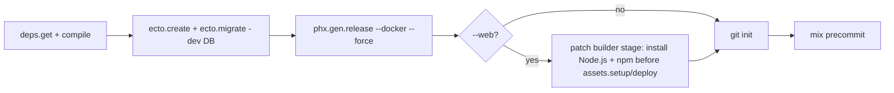

# Phoenix Starter Kit - Review Remediation - Plan

## Goal Capsule

- **Objective:** Resolve every finding from the 2026-07-07 code review of the starter-kit implementation (U1-U11 in the origin plan) - 3 P1, 21 P2, 4 P3 numbered findings (F1-F28) plus the review's advisories and testing-gaps - so the template meets its own Definition of Done and no defect propagates to generated projects.
- **Authority:** Robert - sole design authority. The four design forks were decided at plan time (see Key Technical Decisions KTD-R1..R4). KTD-R3 was subsequently reworked from the plan's ce-doc-review (see that decision's note).
- **Execution profile:** `mix precommit` (plus the birth matrix for birth/prune units) must stay green at every unit boundary. This is a template - every fix must survive both `--web` and `--api` births.
- **Stop conditions:** Surface instead of guessing if (a) the web release image cannot `docker build` green even with Node.js installed into the builder stage (U4/U5), or (b) making AshAdmin functional would require weakening a policy rather than adding an admin actor + bypass (U8).
- **Open blockers:** None. All four design decisions resolved; KTD-R3 reworked per the plan's document review (the original password-nulling mechanism was both unnecessary - the takeover it targeted is already blocked - and mechanically broken; see KTD-R3).

---

## Problem Frame

The kit (built across U1-U11 in the origin plan) is functionally complete and its security core is sound - the review found no P0, verified no IDOR/privilege-escalation, confirmed the prune machinery, and (in the document-review pass) verified that no unconfirmed user is ever issued an authenticated session. But 28 findings remain, concentrated in five areas: **birth/deploy** (the KTD6 Dockerfile path was never implemented; `rsync` copies ignored files; the dev DB is never created), **auth robustness** (magic-link tokens are burned by email prefetchers; a pre-registration squat locks the victim out; a password change silently logs the user out), **prod config** (`PHX_HOST` and the mailer default silently instead of failing loud), **gate coverage** (the two riskiest scripts escape credo/format; migration drift is ungated; a cold checkout crashes the gate), and **test/docs gaps** (password-reset and Notes-controller flows are untested; `--api` loses its AE4 proof; README web prose ships into API newborns).

Because this is a template, each defect is inherited by every generated project, so the bar is "exemplary," and each fix must hold across both flavors.

**Scope:** the findings enumerated in the review report (`scratchpad/ce-review/report.md`), traced below by finding number (F#). Out of scope: new features, the deferred items in the origin plan's Scope Boundaries (OAuth, rate limiting, SSR, etc.), and any change that alters the origin Product Contract.

---

## Requirements

Each requirement maps to review findings (F#) and, where relevant, origin-plan IDs (R#/KTD#/AE#).

- **RR1. Prod fails loud, not silent.** `PHX_HOST` (F2) and the mailer (F6) must raise at boot when unset in prod, via the existing `env!` helper - matching the origin R7/AE5 principle.
- **RR2. Magic-link is prefetch-safe and squat-safe.** The emailed link must not consume the single-use token on a bare GET (F1); a pre-registration squat must not permanently lock the legitimate owner out (F5); the `prevent_hijacking?` interlock that blocks takeover stays on, with its invariant documented (F24).
- **RR3. Auth session correctness.** A password change must not strand the user in a dead session (F4); every sign-in path renews the session id (F26); registration does not leak account existence inconsistently with the other flows (F25).
- **RR4. Birth produces a complete, runnable, deployable newborn.** The birth script copies only tracked files (F7), creates+migrates the dev DB so `mix phx.server` works first-run (F9), and generates a release Dockerfile that actually builds for both flavors per KTD6 (F3).
- **RR5. Prune leaves zero residue and keeps its proofs.** `--api` newborns carry no web prose (F8) and retain AE4 coverage (F12); the birth-matrix residue grep covers docs + `mix.lock` (F8); the web leg smoke-builds the release image (F3); PLT cache uses the split action (F22).
- **RR6. Demo removal is complete and safe.** `remove_demo` drops the Notes table (F10), removes the Notes E2E test (F11), and cannot corrupt pathologically-named apps (F31, advisory).
- **RR7. The gate covers the whole product.** `bin/` scripts are formatted + credo-checked (F14); resource/migration drift is gated (F15); a cold checkout does not crash the gate (F13).
- **RR8. Safe-by-default data access.** Every JSON:API-exposed resource is provably policy-gated (F18); AshAdmin is actually usable by an admin (F19).
- **RR9. Advertised flows are tested.** Password-reset (F17), Notes-controller CRUD + cross-user (F16), and the confirmation failure branch (F30, testing-gap) have coverage.
- **RR10. Docs and versions match reality.** The Version Matrix records the shipped OTP 29 snapshot (F21); AGENTS.md names the blessed form idiom (F20) and points at the demo pattern (F23) and explains the internal build tags (F28); dead code is removed (F27); the shadcn core set is kept per R10 (F20).

> **Finding-number note.** The source review numbered 28 findings (F1-F28) plus unnumbered advisories and testing-gaps. This plan additionally addresses two of those non-numbered items and labels them for traceability: the confirmation-failure-branch testing-gap (F30 here) and the `remove_demo` regex advisory (F31 here). There is no F29.

---

## Key Technical Decisions

Resolved design forks (plan-time, Robert):

- **KTD-R1. Implement KTD6 at birth (F3).** `bin/new_project` runs `mix phx.gen.release --docker --force` after rename+prune. The generated Dockerfile runs `mix assets.setup` + `mix assets.deploy` in a Node-less Elixir builder stage; for `--web` those aliases are phoenix_vite (they shell to `npm`), so birth patches the **builder stage to install Node.js + npm** (matching the pinned Node major) before the assets steps - **not** a separate `node:` stage, because `mix` does not exist in a `node:` image. The `--api` flavor deletes `assets/` before this step and the Dockerfile template gates its assets lines on `File.dir?("assets")`, so the api image omits them and builds unchanged. The birth-matrix web leg smoke-runs `docker build`. Chosen over deferring to `fly launch` because the origin plan's Verification Contract commits to the docker-build smoke.
  - *Execution alternative (noted, not chosen):* committing a maintained multi-stage Dockerfile with the Node stage behind `PRUNE:WEB` markers would give better anti-rot (the fast gate would catch Dockerfile drift on a Phoenix bump, instead of only the slow birth matrix), and would move the patch logic out of `bin/new_project`. It diverges from KTD6's "generated at birth, never committed" stance, so it is recorded here as a viable option the implementer may raise, not the default.
- **KTD-R2. Magic-link uses a POST interstitial (F1).** The emailed link opens a plain controller-rendered confirm page (no LiveView) whose button POSTs the token to the callback; only the POST consumes it. **Mirror the in-repo `StarterKitWeb.Auth.ConfirmationController`**, which already implements exactly this GET-shows / POST-consumes pattern ("stops email scanners and link prefetchers"), rather than building from external references - the change is smaller and consistent with a blessed local pattern. Reconcile the already-set-but-inert `require_interaction? true` on the magic_link strategy (Pattern B enforces interaction at the controller, not through the framework flag): remove it, or comment why it is inert. Supersedes the origin KTD3 "plain GET" choice for magic-link.
- **KTD-R3. Keep `prevent_hijacking? true`; resolve the squatting *lockout* by expiring unconfirmed accounts (F5, F24).** *Reworked from the plan's ce-doc-review.* The original idea - disable `prevent_hijacking?` and null `hashed_password` on the magic-link upsert - was withdrawn for two independently-verified reasons: (1) **unnecessary** - the account-takeover it targeted is already blocked, because `register_with_password`'s token is generated and *discarded* by `RegistrationController` (never put in a session) and `require_confirmed_with :confirmed_at` blocks password sign-in until confirmation, so an email-squatter gains no authenticated access; and (2) **mechanically broken** - `sign_in_with_magic_link` declares `upsert_fields([:email])`, so a change nilling `hashed_password` is dropped from the `ON CONFLICT` write (a no-op exactly on the squat path), and applying the same change to `reset_password_with_token` (an `:update` that *sets* the new password) is redundant-or-destructive. Disabling a framework security default the AshAuthentication docs call "not recommended," to hand-roll a mechanism with those failure modes, for no security gain, is the wrong trade. **Chosen approach:** keep `prevent_hijacking? true`. The only real residual defect is F5's *lockout* (the victim's magic-link is blocked while an unconfirmed squat exists). Resolve it by expiring unconfirmed accounts - an `ash_oban` scheduled trigger (or plain Oban cron worker) that destroys `User` records with `confirmed_at` nil older than a configurable window (default 7 days) - so a squat self-heals and the email frees itself. Keep the F24 invariant comment (`prevent_hijacking?` stays true; do not disable without a vetted password-clearing upsert). Uses infrastructure the kit already ships (`ash_oban`) and demonstrates a periodic-job pattern.
- **KTD-R4. Update the Version Matrix to the shipped OTP 29 snapshot (F21).** Record Erlang 29.0.2 / Elixir 1.20.1-otp-29 as canonical (README + an erratum note in the origin plan's Version Matrix), noting it postdates the origin OTP-27 primary-source pass. No code/pin churn - the stack is green on OTP 29.

Default resolutions (not forks, but load-bearing):

- **KTD-R5. Keep the shadcn `Form`/`Dialog` per origin R10 (F20).** They are the "core component set copied in" for consumers; the fix is an AGENTS.md note naming the blessed idiom (`field.tsx` + Inertia `useForm`) and demonstrating `Dialog` in the Notes delete-confirm so the shipped component proves itself.
- **KTD-R6. Make AshAdmin functional (F19).** Add an admin-bypass policy (`bypass actor_attribute_equals(:admin?, true) do authorize_if always() end`) to the exposed resources, **and feed the AshAdmin actor via a custom `AshAdmin.ActorPlug`** (`config :ash_admin, :actor_plug, ...`) that reads `conn.assigns.current_user` and calls `Ash.PlugHelpers.set_actor`. ash_admin 1.1.0 resolves its actor through the ActorPlug, *not* a pipeline assign, so a bare assign would leave the bypass un-fired and the admin still seeing empty/forbidden lists (the exact F19 symptom). Note: the resource-level bypass is not action-type-scoped, so an admin's credentials via *any* authenticated surface (session, API key, JWT) grant full CRUD on User/Note, not only the `/admin` UI - deliberate (admin power is admin-gated; it adds no path for a non-admin to gain access).
- **KTD-R7. Enforce the authorizer invariant with a test, not a convention (F18).** A template-level test asserts every `AshJsonApi.Resource` module in the domains sets `authorizers`, so a future exposed resource cannot be silently world-readable.

---

## High-Level Technical Design

Magic-link flow, before and after KTD-R2/R3:

```mermaid
flowchart TB
  subgraph Before [Before - bare GET consumes]
    E1[Email link GET /auth/magic-link?token=] --> C1[callback consumes token]
    C1 --> S1[session]
    SC1[Email scanner GET] -.burns token.-> C1
  end
  subgraph After [After - POST interstitial]
    E2[Email link GET /auth/magic-link?token=] --> P2[render confirm page - no consume]
    P2 --> B2[user clicks Confirm -> POST token]
    B2 --> C2[callback consumes token]
    C2 --> OK2[sign in: store_in_session + renew session id]
    SC2[Email scanner GET] -.hits confirm page, no consume.-> P2
  end
  subgraph Squat [Squat lockout self-heals - prevent_hijacking stays true]
    A3[Attacker registers victim@x, unconfirmed] -.token discarded, no access.-> X3[blocks victim magic-link claim]
    X3 --> W3[ash_oban expiry destroys unconfirmed > window]
    W3 --> F3ok[victim's email frees itself]
  end
```

Birth pipeline additions (KTD-R1), inserted into `setup!/2` after prune, before the gate:

---

## Implementation Units

| U-ID | Title | Key files | Depends on |
|---|---|---|---|
| U1 | Prod fail-loud config | config/runtime.exs, config/config.exs | - |
| U2 | Magic-link: POST interstitial + squat self-heal | lib/starter_kit/accounts/user.ex, controllers/auth/magic_link_controller.ex, accounts/workers/ | - |
| U3 | Auth session + enumeration hardening | controllers/auth/{settings,session,registration}_controller.ex | - |
| U4 | Birth script: copy hygiene, dev DB, release artifact | bin/new_project | - |
| U5 | Prune completeness + birth-matrix hardening | .github/workflows/birth-matrix.yml, README.md, admin_access_test.exs | U4 |
| U6 | remove_demo robustness | bin/remove_demo, test/e2e/notes_test.exs | - |
| U7 | Quality-gate coverage | .formatter.exs, .credo.exs, mix.exs | U4, U6 |
| U8 | API authorizer guard + functional AshAdmin | lib/starter_kit/**, router.ex | U5 |
| U9 | Test coverage: password-reset, Notes, confirmation | test/starter_kit_web/** | U2, U3, U8 |
| U10 | Docs, versions, agent legibility, dead-code cleanup | AGENTS.md, README.md, docs/plans/2026-07-06-001 | U1-U9 |

### U1. Prod fail-loud config

- **Goal:** `PHX_HOST` and the prod mailer raise at boot when unset, instead of silently defaulting.
- **Requirements:** RR1 (F2, F6). Advances origin R7, AE5.
- **Dependencies:** None.
- **Files:** `config/runtime.exs`, `config/config.exs`, `.env.example`, `test/starter_kit/runtime_config_test.exs`.
- **Approach:** In `runtime.exs`, replace `host = System.get_env("PHX_HOST") || "example.com"` with `host = env!.("PHX_HOST")` inside the existing prod block, reusing the `env!` closure that already guards DATABASE_URL/SECRET_KEY_BASE/TOKEN_SIGNING_SECRET (verified present and called as `env!.("...")` at `runtime.exs:31`). Configure `StarterKit.Mailer` from env in the prod block via the same helper (mailer adapter + credentials), or raise if the adapter would resolve to `Swoosh.Adapters.Local` in prod. Keep dev/test on Local. Add `PHX_HOST` (and the mailer vars) to `.env.example` under the "Required in production" group.
- **Patterns to follow:** the existing `env!/1` closure and the DATABASE_URL block in `config/runtime.exs`.
- **Test scenarios:**
  - Covers AE5. Boot with `PHX_HOST` unset in prod raises and names `PHX_HOST` (extend `runtime_config_test.exs`'s `@required` list + its assertion).
  - Boot with the prod mailer vars unset raises and names the missing var (or names the `Local`-in-prod misconfiguration).
  - Dev/test boot unaffected: mailer stays `Local`, no host requirement.
- **Verification:** Gate green; `runtime_config_test` proves both new required-var cases.

### U2. Magic-link: POST interstitial + squat self-heal

- **Goal:** The magic-link token is consumed only by an explicit POST (prefetch-safe), and a pre-registration email squat self-heals rather than permanently locking the victim out - without disabling the `prevent_hijacking?` interlock that already blocks takeover.
- **Requirements:** RR2 (F1, F5, F24) + the F26 renewal cross-cut for the magic-link sign-in site. Advances origin R3, KTD3.
- **Dependencies:** None.
- **Files:** `lib/starter_kit/accounts/user.ex` (magic_link `require_interaction?` reconcile; add the expiry trigger/worker wiring - the confirmation add-on stays `prevent_hijacking? true`), `lib/starter_kit_web/controllers/auth/magic_link_controller.ex`, `lib/starter_kit_web/router.ex`, `lib/starter_kit/accounts/user/senders/send_magic_link_email.ex`, `lib/starter_kit/accounts/workers/expire_unconfirmed_users.ex` (new) + Oban queue/schedule config, `assets/js/pages/auth/magic-link-confirm.tsx` (new interstitial) *or* a plain controller-rendered confirm page, `test/starter_kit_web/controllers/auth/magic_link_controller_test.exs`, `test/starter_kit/accounts/expire_unconfirmed_users_test.exs` (new).
- **Approach:**
  - *(KTD-R2, F1)* Route the emailed GET `/auth/magic-link?token=` to an action that *renders* a confirm page carrying the token in a hidden field (no LiveView, no token consumption); a Confirm button POSTs to a new `/auth/magic-link` POST route that calls `Accounts.sign_in_with_magic_link` and consumes the token. Mirror `ConfirmationController.show/confirm`. The new POST route is a same-path sibling inside the existing `:browser` scope, so it inherits `protect_from_forgery` (CSRF) by default. Reconcile the inert `require_interaction? true` on the magic_link strategy.
  - *(KTD-R3, F5/F24)* Keep the confirmation add-on `prevent_hijacking? true`. Add an `ash_oban` scheduled trigger (or plain Oban cron worker) that destroys `User` records where `confirmed_at` is nil and `inserted_at` is older than a configurable window (default 7 days), so an unconfirmed squat self-heals. Add the F24 invariant comment on the confirmation block. **Do not** add any `hashed_password`-nulling change and **do not** touch `reset_password_with_token`.
  - *(F26 cross-cut)* At the magic-link sign-in success branch, call `configure_session(conn, renew: true)` immediately after `AshAuthentication.Plug.Helpers.store_in_session/2` (`store_in_session` does not renew on its own). U3 adds the same two-line pair at the password sign-in site; extract a shared helper only if a third sign-in path appears.
  - *(hardening, from doc-review)* HTML-escape the interpolated `params[:email]` in `send_magic_link_email.ex`'s body (`Phoenix.HTML.html_escape/1`) before embedding it in `html_body`.
- **Execution note:** Security-relevant - test-first for the expiry worker. Prove it destroys *only* unconfirmed users past the window and never a confirmed user or a fresh unconfirmed one.
- **Patterns to follow:** the in-repo `ConfirmationController`; the existing `ash_oban` wiring in the app; `AshAuthentication.Plug.Helpers`.
- **Test scenarios:**
  - A bare GET to the emailed URL renders the confirm page and does NOT consume the token (a second GET still shows the page; the token still works via POST). Simulates an email prefetcher.
  - POST with a valid token signs the user in, renews the session id, and revokes the single-use token; a replay POST fails.
  - POST with a garbage/expired token safe-fails to sign-in with a flash, no session.
  - POST without a valid CSRF token is rejected (the new mutating route is CSRF-protected).
  - Squat is non-authenticating: after an attacker's unconfirmed `register_with_password(victim@x, known-pw)`, no session/token exists for that account and a password sign-in is refused (unconfirmed) - documents that F5 is a lockout, not a takeover.
  - Expiry worker: an unconfirmed user older than the window is destroyed; a confirmed user and a within-window unconfirmed user are both retained.
  - Property/negative: an ordinary (no pre-existing record) magic-link sign-in still works end-to-end.
- **Verification:** Gate green; manual dev pass of the interstitial; expiry-worker test green.

### U3. Auth session + enumeration hardening

- **Goal:** A password change leaves the user with an honest next step; every sign-in renews the session; registration matches the enumeration posture of the other flows.
- **Requirements:** RR3 (F4, F25, F26). Advances origin R3, R17.
- **Dependencies:** None.
- **Files:** `lib/starter_kit_web/controllers/auth/settings_controller.ex`, `session_controller.ex`, `registration_controller.ex`, `test/starter_kit_web/controllers/auth/{settings,session,registration}_controller_test.exs`.
- **Approach:**
  - *(F4)* Redirect to `/sign-in` with an honest "password changed - sign in again" flash. This is the simplest provably-correct fix: `change_password` touches `hashed_password`, so `log_out_everywhere`'s revocation hook fires and revokes *all* tokens in the same transaction. Minting a replacement *inside* the action would be revoked by that same sweep (reproducing the very bug), and minting *after* the action returns couples this unit to sign-in tokens staying enabled. The redirect avoids both traps and keeps `log_out_everywhere`'s attacker-session-termination intact. *(If seamless re-auth is later wanted: mint via `AshAuthentication.Jwt.token_for_user/2` on the `{:ok, user}` result AFTER `change_password` returns - never as a change on the action - and only while sign-in tokens are enabled.)*
  - *(F26)* Add `configure_session(conn, renew: true)` immediately after `store_in_session` at the password sign-in site. U2 adds the same at the magic-link site so both primary sign-in paths renew.
  - *(F25)* On a duplicate-email registration, return the same confirm-pending outcome as a new signup instead of surfacing the "has already been taken" uniqueness error.
- **Patterns to follow:** the enumeration-safe `magic_link_controller`/`password_reset_controller` responses; `AshAuthentication.Plug.Helpers`.
- **Test scenarios:**
  - Password change redirects to `/sign-in` with the change flash, and the prior session no longer authenticates an auth-required page (closing the blind spot that hid F4).
  - Both sign-in paths renew the session id (session id differs pre/post login) - password here, magic-link in U2.
  - Registering an already-registered email returns the confirm-pending outcome with no "has already been taken" error surfaced.
  - Regression: a brand-new registration still succeeds and sends the confirmation email.
- **Verification:** Gate green; the settings test now follows the redirect and asserts the old session is dead.

### U4. Birth script: copy hygiene, dev DB, release artifact

- **Goal:** Births copy only tracked files, set up a runnable dev DB, and generate a release Dockerfile that builds for both flavors.
- **Requirements:** RR4 (F3, F7, F9). Advances origin R21, KTD6.
- **Dependencies:** None.
- **Files:** `bin/new_project`.
- **Approach:** (F7) Replace the `rsync --exclude` list with `rsync -a --filter=':- .gitignore' --exclude=.git ./ target/`, or switch to `git archive HEAD | tar -x -C target` (tracked-only). Also delete the stray `erl_crash.dump` from the template root as a repo-hygiene step. (F9) In `setup!/2`, after `mix compile`, run `mix ecto.create` + `mix ecto.migrate` (or `mix ash.setup`) so the dev DB exists before `next_steps` tells the user to run `mix phx.server`. (F3/KTD-R1) After the dev-DB step and before `git_init!`, run `mix phx.gen.release --docker --force`; for `--web`, patch the **builder stage** of the generated Dockerfile to install Node.js + npm (matching the pinned Node major) before the emitted `RUN mix assets.setup` / `RUN mix assets.deploy` lines - patch at a fixed string anchor (e.g. the builder `FROM ... AS builder` line or the `RUN mix deps.get` line). The `--api` flavor needs no assets patch (its `assets/` dir is deleted before this step and the Dockerfile template gates the assets lines on `File.dir?("assets")`). Keep fail-loud semantics; add a friendly `die()` if `rsync`/`git`/`npm`/`mix`/`docker` are absent instead of a raw `{_, 0}` MatchError. Pass `-c commit.gpgsign=false` to the birth `git commit`.
- **Execution note:** Verification-first - born-web and born-api into the scratchpad, gate each, and confirm `mix phx.server` boots + a `docker build` of the web newborn succeeds, before U5 wires the docker smoke into CI.
- **Patterns to follow:** the existing `setup!/2` step structure and `mix!/3` helper; Phoenix's `phx.gen.release` Dockerfile template (`RUN mix assets.setup` / `RUN mix assets.deploy` in the Elixir builder).
- **Test scenarios:** (script self-verified via births)
  - A `--web` birth: no `erl_crash.dump` / untracked files in the newborn; `mix phx.server` boots against a created dev DB; `docker build` of the generated Dockerfile succeeds (Node present in the builder, `mix assets.deploy` runs).
  - A `--api` birth: same copy hygiene; the generated Dockerfile omits the assets lines and builds.
  - Missing-binary path: with `rsync` (or `docker`) absent (simulated), the script dies with a named error, not a stacktrace.
- **Verification:** Both flavors born clean locally; dev server boots; web image builds.

### U5. Prune completeness + birth-matrix hardening

- **Goal:** `--api` newborns carry no web residue and keep AE4 coverage; CI greps docs+lockfile, smoke-builds the web image, and uses the split PLT cache.
- **Requirements:** RR5 (F3, F8, F12, F22). Advances origin R16, R22, AE1, AE4.
- **Dependencies:** U4 (Dockerfile must be generated to smoke-build it).
- **Files:** `.github/workflows/birth-matrix.yml`, `README.md`, `test/starter_kit_web/admin_access_test.exs`, `bin/new_project`.
- **Approach:** (F8) Wrap the web-only sections of `README.md` in `<!-- PRUNE:WEB -->` / `<!-- PRUNE:END -->` markers (verified: `apply_markers` iterates all text files and matches the `PRUNE:WEB` substring, so README markers are honored); broaden the birth-matrix residue check from `grep -rniE 'inertia|phoenix_vite' lib config mix.exs` to include `README.md AGENTS.md mix.lock`. (F12) Make `admin_access_test.exs` flavor-agnostic (assert `conn.status in [302, 404]` for anon rather than a web-specific sign-in redirect), and remove it from `@api_delete` in `bin/new_project` so `--api` retains AE4 coverage. (F3-CI) Add a web-leg `docker build` smoke step. (F22) Change the "Restore newborn PLT cache" step from `actions/cache@` to `actions/cache/restore@` (a save step already exists).
- **Coordination:** U8 also edits `admin_access_test.exs` (adding admin-can-list assertions); U8 depends on U5 so this flavor-agnostic rewrite lands first.
- **Patterns to follow:** `ci.yml`'s split restore/save PLT pattern; the existing birth-matrix residue-grep + `apply_markers` substring convention.
- **Test scenarios:** (workflow is the test)
  - `--api` leg: residue grep over `lib config mix.exs README.md AGENTS.md mix.lock` finds no `inertia`/`phoenix_vite`; the retained admin test passes (anon -> 302/404).
  - `--web` leg: `docker build` of the birth-generated Dockerfile succeeds; PLT cache restores without a double-save warning.
- **Verification:** Both matrix legs green; the api leg proves AE4; the web leg builds the image.

### U6. remove_demo robustness

- **Goal:** Demo removal drops the Notes table, removes the Notes E2E test, and cannot corrupt oddly-named apps.
- **Requirements:** RR6 (F10, F11, F31). Advances origin R23, AE3.
- **Dependencies:** None.
- **Files:** `bin/remove_demo`, `test/e2e/notes_test.exs`.
- **Approach:** (F11) Add a `# DEMO:` marker as the first line of `test/e2e/notes_test.exs`; confirm `prune_empty_dirs` then removes the now-empty `test/e2e/`. (F10) Before the gate, generate a timestamped `drop_notes` migration mirroring `create_notes`'s `down/0` (drop the FK, then `drop table(:notes)` - verified the origin migration's `down/0` does exactly this), or shell `mix ash_postgres.generate_migrations drop_notes --yes` after the Notes resource files are deleted - so a DB that already ran `create_notes` before removal is cleaned rather than leaving an orphaned table. Reconcile the script header ("run before applying migrations") with the realistic use case (remove once real features - and their migrations - exist). (F31) Anchor the `NoteController` token in `@demo_tokens` (`\bNoteController\b`) so it cannot match `NoteControllerWeb` or a consumer's own controller.
- **Patterns to follow:** the origin `create_notes` migration's `down/0`; the existing marker-scan + `prune_empty_dirs`.
- **Test scenarios:** (script self-verified on a scratch birth)
  - After `remove_demo`: `grep -rn DEMO` is empty (including `test/e2e/`), `test/e2e/` is gone, and a `drop_notes` migration exists.
  - On a newborn whose app module superstrings `NoteController`, `remove_demo` does not strip unrelated lines.
  - Covers AE3: `mix precommit` green after removal.
- **Verification:** Scratch birth -> `remove_demo` -> gate green, no residue, table dropped.

### U7. Quality-gate coverage

- **Goal:** The gate formats+credo-checks the `bin/` scripts, gates Ash migration drift, and does not crash on a cold checkout.
- **Requirements:** RR7 (F13, F14, F15). Advances origin R15, KTD12.
- **Dependencies:** U4, U6 (so the credo/format fixes cover the final `bin/` code).
- **Files:** `.formatter.exs`, `.credo.exs`, `mix.exs`, `bin/new_project`, `bin/remove_demo`.
- **Approach:** (F14) Add `bin/*` to `.formatter.exs` `inputs` and `bin/` to `.credo.exs` `included`; fix the surfaced findings (add `@moduledoc` to `NewProject`/`RemoveDemo`, reduce `parse!/1` cyclomatic complexity). (F15) Add `ash_postgres.generate_migrations --check` to the `precommit` alias (before `test`) - verified the task exists in ash_postgres 2.10 - so resource/migration/snapshot drift fails the gate. (F13) Add `assets.build` to the `setup` alias inside the existing `PRUNE:WEB` block (or gate it into the `test` alias) so a cold checkout has a Vite manifest before `GET "/"` reads it (`phoenix_vite`'s `manifest.ex` raises unrescued when the manifest is absent).
- **Patterns to follow:** the existing `precommit`/`setup`/`test` aliases; the `PRUNE:WEB` block already in `mix.exs`.
- **Test scenarios:**
  - `mix credo --strict` and `mix format --check-formatted` now include `bin/new_project` + `bin/remove_demo` and pass.
  - A deliberate resource/migration drift (temporarily) makes `mix precommit` fail at the new `--check` step.
  - A cold checkout (`rm -rf priv/static _build`) runs `mix setup` then `mix precommit` without the manifest crash.
- **Verification:** Gate green from a cold checkout; drift check present and effective.

### U8. API authorizer guard + functional AshAdmin

- **Goal:** Every JSON:API-exposed resource is provably policy-gated, and an admin can actually use AshAdmin.
- **Requirements:** RR8 (F18, F19). Advances origin R5, R13, R14, AE4.
- **Dependencies:** U5 (shares `admin_access_test.exs`; U5's flavor-agnostic rewrite lands first).
- **Files:** `lib/starter_kit/accounts/user.ex`, `lib/starter_kit/notes/note.ex`, `lib/starter_kit_web/router.ex` + a small `AshAdmin.ActorPlug` module, `config/config.exs` (`:ash_admin, :actor_plug`), `test/starter_kit_web/api/json_api_test.exs`, `test/starter_kit_web/admin_access_test.exs`.
- **Approach:** (KTD-R7/F18) Add a template test that enumerates the JSON:API domains and asserts every resource with `AshJsonApi.Resource` in its extensions also has `Ash.Policy.Authorizer` in `authorizers` - failing if a future exposed resource forgets it. (KTD-R6/F19) Add an admin-bypass policy to the exposed resources (`bypass actor_attribute_equals(:admin?, true) do authorize_if always() end`) and wire a custom `AshAdmin.ActorPlug` that reads `conn.assigns.current_user` and calls `Ash.PlugHelpers.set_actor`, registered via `config :ash_admin, :actor_plug, ...` - so a gated-in admin actually reaches Ash as the actor and can list/manage User + Note. Document that the bypass applies to all authenticated surfaces, not just `/admin` (see KTD-R6).
- **Patterns to follow:** the existing `policies do ... end` blocks in `user.ex`/`note.ex`; `AshAdmin.ActorPlug` behaviour + `Ash.PlugHelpers`.
- **Test scenarios:**
  - The authorizer-invariant test passes for User+Note and fails if a resource is exposed without an authorizer (prove with a temporary fixture or a comment-documented negative).
  - Prod-mode: an admin user reaches AshAdmin AND lists User/Note rows (not empty/forbidden); a non-admin is still denied (AE4 preserved).
  - Non-admin/anon cross-user API reads remain denied (no regression from the admin-only bypass).
- **Verification:** Gate green; admin can manage resources; invariant test guards future resources.

### U9. Test coverage: password-reset, Notes, confirmation

- **Goal:** The advertised flows left untested now have coverage, including the security-critical DENY paths.
- **Requirements:** RR9 (F16, F17, F30). Advances origin R17, AE2.
- **Dependencies:** U2, U3 (tests must reflect the final auth behavior), U8 (admin bypass).
- **Files:** `test/starter_kit_web/controllers/auth/password_reset_controller_test.exs` (new), `test/starter_kit_web/controllers/note_controller_test.exs`, `test/starter_kit_web/controllers/auth/registration_controller_test.exs` (confirmation branch).
- **Approach:** (F17) New `password_reset_controller_test.exs` mirroring the sibling auth tests: GET renders the Inertia component; POST request is enumeration-safe (email sent, generic flash, redirect `/sign-in`) whether or not the email exists; extract the token from the emailed body; POST reset with a valid token + matching password redirects to `/sign-in`, the new password signs in, the old does not; a garbage/expired token re-renders with `inertia_errors`. (F16) Extend `note_controller_test.exs` with owner happy-path edit/update/delete over HTTP, a cross-user test (alice's note, signed in as bob -> get/put/delete redirects to `/notes` with "Note not found" and the note stays unmodified), and a create validation-error test (blank title -> `notes/form` + errors). (F30) Add a garbage-token `POST /auth/confirm` test asserting redirect `/sign-in` + flash error.
- **Patterns to follow:** the existing `magic_link_controller_test.exs` token-extraction and `session_controller_test.exs` patterns; `notes_api_test.exs`'s cross-user structure (mirror it web-side).
- **Test scenarios:** (this unit is tests)
  - Covers R17 + the DENY halves above; specifically the password-reset happy + sad paths, Notes cross-user 3-verb denial, and the confirmation failure branch.
- **Verification:** Gate green with the new tests; coverage now includes password-reset and Notes-controller cross-user.

### U10. Docs, versions, agent legibility, dead-code cleanup

- **Goal:** Docs and versions match reality; the agent layer names the blessed patterns; dead code is gone.
- **Requirements:** RR10 (F20, F21, F23, F27, F28) + advisories. Advances origin R10, R25.
- **Dependencies:** U1-U9 (docs reflect the final state).
- **Files:** `AGENTS.md`, `README.md`, `docs/plans/2026-07-06-001-feat-phoenix-starter-kit-plan.md` (Version Matrix erratum), `lib/starter_kit/accounts/user.ex`, `assets/js/pages/notes/index.tsx`, `config/config.exs`, `CONTRIBUTING.md`/`docs/github-settings.md`.
- **Approach:** (KTD-R4/F21) Ensure README's stack table states Erlang 29.0.2 / Elixir 1.20.1; add a one-line erratum note to the origin plan's Version Matrix recording the OTP 29 snapshot as canonical (postdating the OTP-27 pass). (KTD-R5/F20) Add an AGENTS.md note naming the blessed form idiom (`field.tsx` + Inertia `useForm`) vs the shipped shadcn `Form`, keep both per R10, and demo `Dialog` in the Notes delete-confirm (`assets/js/pages/notes/index.tsx`) so the shipped component proves itself. (F23) Give the AGENTS.md "blessed pattern" pointer a concrete path (`lib/starter_kit/notes/` + `note_controller.ex`). (F28) Add one AGENTS.md sentence that bracketed tags (`R23`, `KTD3`, `AE4`, "Pattern B") in comments are internal build tags, safe to ignore. (F27) Delete the dead `sign_in_with_token` action (verify unreferenced first). **Do not** set `sign_in_tokens_enabled? false` - the session/password sign-in flows depend on token-backed sessions, and disabling it would break U3's sign-in and the API; F27 is a dead-*action* removal only. Advisories: decide+document the JSON-error format (`config/config.exs` - add a minimal `ErrorHTML` for `--web` or document JSON-only), and reconcile the `github-settings.md` "forkers may open Issues" line with `CONTRIBUTING.md`'s no-issues posture.
- **Patterns to follow:** the existing AGENTS.md managed-section + pointer style; the shipped `Dialog` component API.
- **Test scenarios:** `Test expectation: none` for the doc/version/comment edits. For the `Dialog` demo + `sign_in_with_token` removal: the existing Notes and auth tests stay green (delete-confirm still deletes; no reference to the removed action; sign-in still works because sign-in tokens remain enabled).
- **Verification:** Gate green; `grep -ri "sign_in_with_token"` clean; AGENTS.md names the idiom + pattern path; README/plan record OTP 29.

---

## Verification Contract

| Check | Command | Applies to | Proves |
|---|---|---|---|
| Quality gate | `mix precommit` (now incl. `ash_postgres.generate_migrations --check`, and `bin/` under format+credo) | every unit boundary | RR1, RR3, RR7, RR8, RR9 |
| Birth matrix | `.github/workflows/birth-matrix.yml` (residue grep over docs+mix.lock, web docker-build smoke, retained admin test, split PLT cache) | U4, U5, U6 | RR4, RR5, RR6, AE1, AE3, AE4 |
| Deploy image smoke | `docker build` of the birth-generated web Dockerfile (Node in builder) | U4, U5 | KTD-R1 / F3 |
| Cold-checkout gate | `rm -rf _build priv/static && mix setup && mix precommit` | U7 | F13 |
| Magic-link security | prefetch-safe GET + CSRF-protected POST + squat-is-non-authenticating + expiry-worker tests | U2, U9 | RR2 (F1, F5, F24) |
| Session correctness | settings redirect + both-paths session-renew tests | U2, U3, U9 | RR3 (F4, F26) |
| Boot validation | `runtime_config_test` (PHX_HOST + mailer) | U1 | RR1, AE5 |
| Admin gating | prod-mode `admin_access_test` (both flavors; admin lists rows) | U5, U8 | RR8, AE4 |
| Docs/version consistency | `grep -ri sign_in_with_token` clean; AGENTS.md/README/matrix review | U10 | RR10 (F20, F21, F23, F27, F28) |

Gate ordering note: keep dialyzer last; the new `generate_migrations --check` runs early (fast-fail) before `test`.

---

## Definition of Done

- All units U1-U10 complete; `mix precommit` green at the template root, including from a cold checkout.
- Both CI workflows green: template gate AND birth matrix (web + api legs, incl. Playwright, web `docker build` smoke, and post-`remove_demo` gate).
- Every numbered review finding F1-F28, plus the review's advisories and testing-gaps (including F30/F31 as labeled here), resolved or explicitly, deliberately deferred (none expected). There is no F29.
- Magic-link is prefetch-safe, its POST is CSRF-protected, unconfirmed squats self-heal via expiry, and `prevent_hijacking?` stays true; `PHX_HOST`/mailer fail loud in prod.
- Newborns (both flavors) born clean, boot `mix phx.server` first-run, and the web image builds; `--api` carries no web residue and retains AE4 coverage.
- AGENTS.md names the blessed idiom + demo pattern path; README + origin-plan matrix record the OTP 29 snapshot; no dead `sign_in_with_token`; sign-in tokens remain enabled.
- No new dead-end code; the demo slice remains the only deliberately-removable code (via `remove_demo`).

---

## Open Questions

Deferred to implementation (execution-time, none blocking):

- **U2 (interstitial surface):** Inertia page vs minimal controller-rendered HEEx page - pick whichever keeps `--api` prune clean (the confirm page is web-flavor; ensure it prunes or is flavor-appropriate).
- **U2 (expiry policy):** the unconfirmed-account window (default 7 days) and whether to notify on prune; the lazier alternative is to document F5 as an accepted bounded lockout and skip the worker - confirm the worker is wanted at execution.
- **U6 (drop migration):** generate `drop_notes` by hand (mirror `down/0`) vs `mix ash_postgres.generate_migrations` - confirm the generator emits a clean single drop at implementation time.
- **U8 (ActorPlug):** confirm the custom `AshAdmin.ActorPlug` reads `conn.assigns.current_user` and sets the actor correctly against the pinned `ash_admin` 1.1.0 API (the actor is resolved through the plug, not a pipeline assign).
